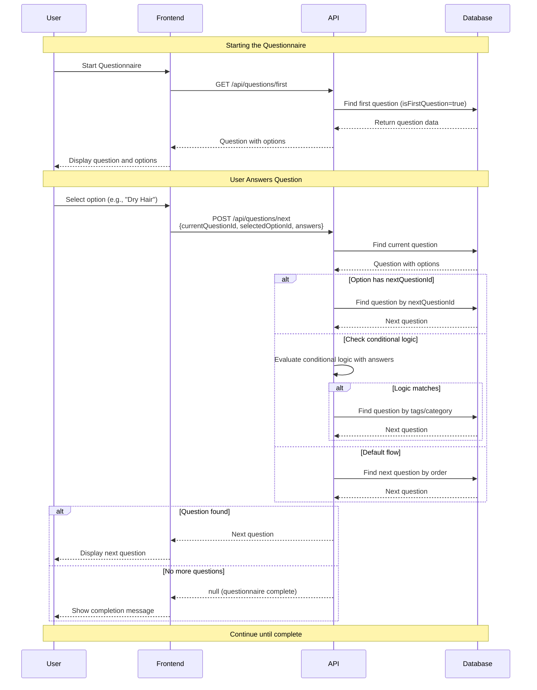
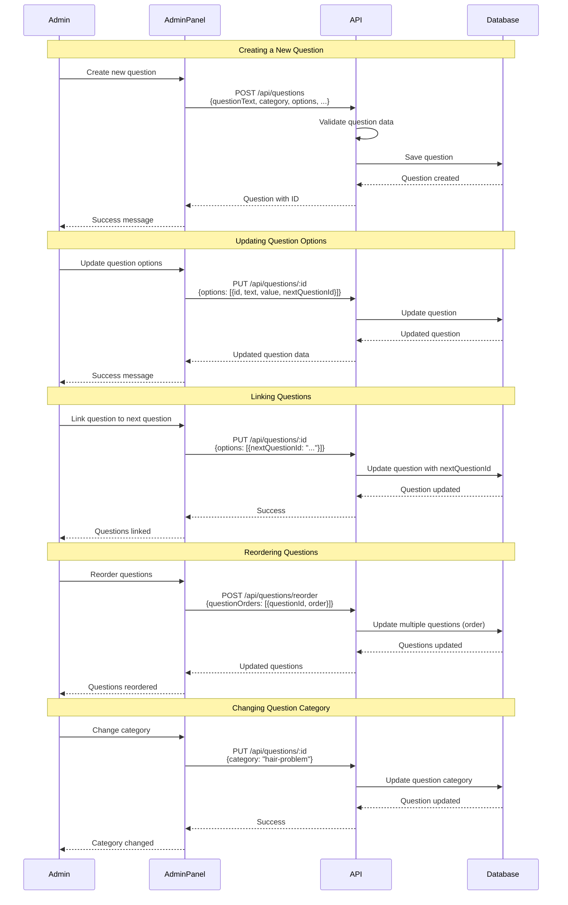
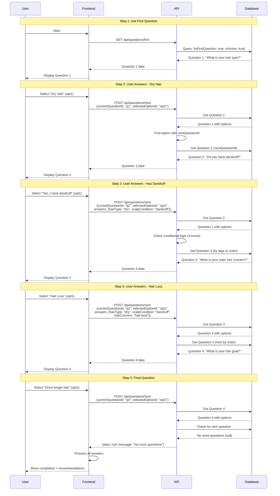
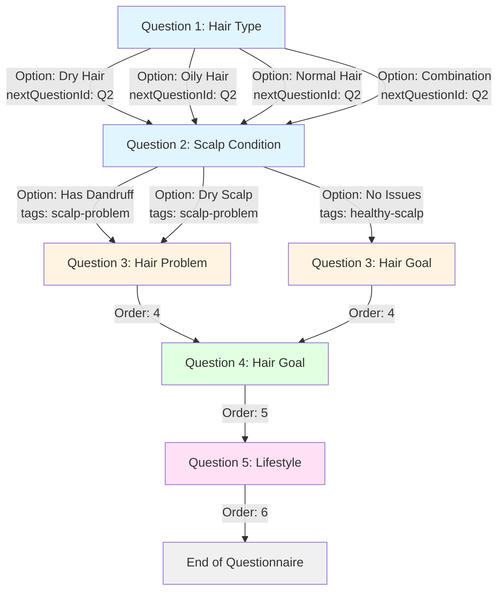
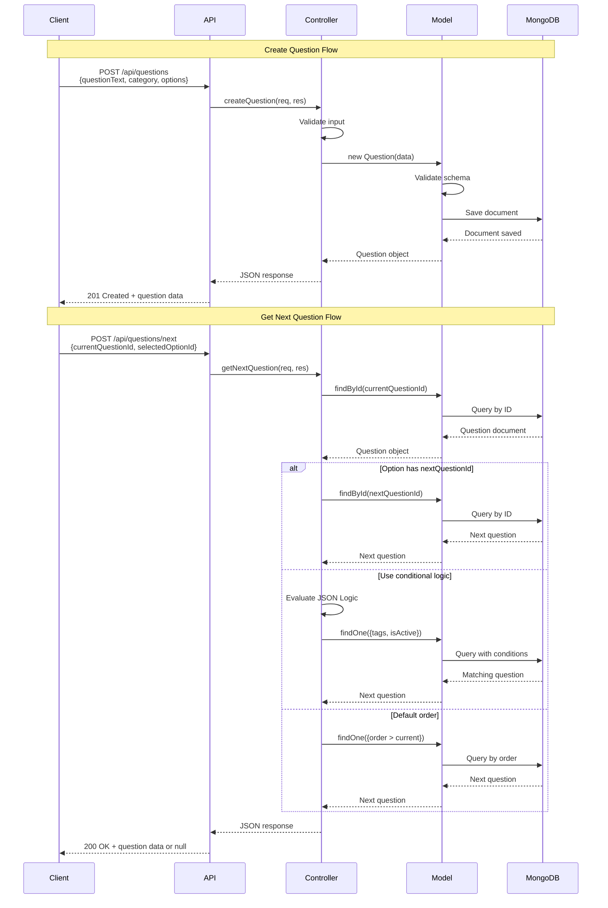
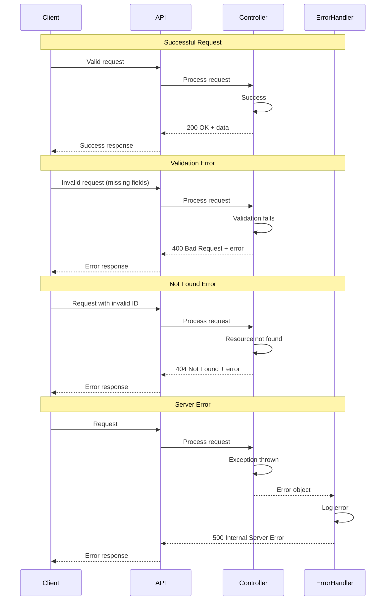

# Hair Care Questionnaire - Sequence Diagram

This document contains sequence diagrams showing the flow of the Hair Care Questionnaire system.

## User Questionnaire Flow

## Admin Management Flow

## Complete Questionnaire Flow with Conditional Logic

## Question Linking Strategies

## API Request/Response Flow

## Error Handling Flow

---

## Diagram Legend

- **Solid arrows**: Request/Response flow
- **Dashed arrows**: Data flow or conditional paths
- **Notes**: Explanatory annotations
- **Alt blocks**: Conditional logic paths
- **Participants**: Different components in the system

---

## How to View These Diagrams

1. **Mermaid Support**: These diagrams use Mermaid syntax and can be viewed in:
   - GitHub (renders automatically in .md files)
   - VS Code with Mermaid extension
   - Online at [Mermaid Live Editor](https://mermaid.live/)
   - Documentation tools like GitBook, Notion, etc.

2. **Alternative Formats**: If you need these in other formats:
   - Export from Mermaid Live Editor as PNG/SVG
   - Use tools like PlantUML for different diagram styles
   - Use draw.io for manual editing

---

For more details, see the [Usage Examples](./questionnaire-usage.md) file.

